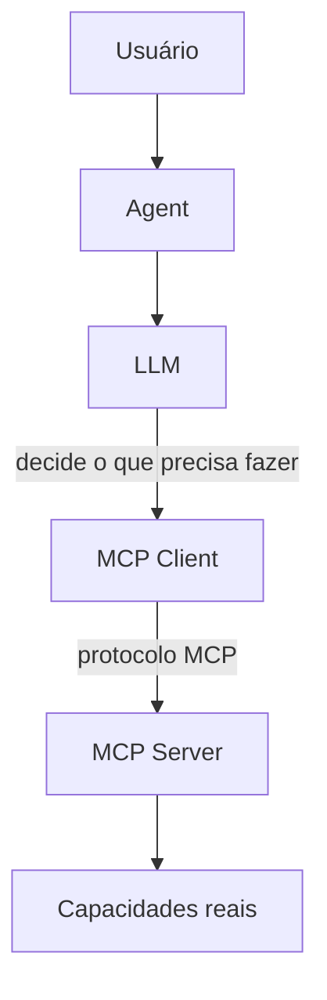
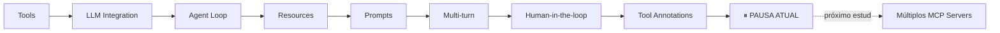

# Go MCP Lab

## Guia de Estudo — MCP, LLMs e Agentes com Go

Este documento registra o aprendizado construído no projeto **go-mcp-lab**, com foco nos conceitos de **Model Context Protocol (MCP)** e **arquitetura de agentes**.

A persistência e as camadas tradicionais da aplicação são apenas detalhes de apoio. O objetivo principal do laboratório é entender como uma LLM descobre capacidades, decide quando utilizá-las, executa ações através de MCP e continua seu raciocínio com os resultados obtidos.

> Módulo: `github.com/CayoHenri/go-mcp-lab`

Este README ficou propositalmente enxuto. Cada tópico foi detalhado em um documento próprio dentro de `/docs`.

---

## Ideia central

> Como permitir que uma LLM utilize funcionalidades reais de uma aplicação sem acoplar diretamente o modelo ao código?

A resposta estudada foi **MCP**.



> **MCP não é o agente e MCP não é a inteligência.**
> MCP fornece um protocolo padronizado para disponibilizar capacidades e contexto. A inteligência continua sendo responsabilidade da LLM e da lógica de orquestração do Agent.

## Os quatro componentes

| Componente | Papel | Detalhes |
|---|---|---|
| **LLM** | Interpreta linguagem natural e decide o que precisa acontecer | [`docs/01-conceitos-fundamentais.md`](docs/01-conceitos-fundamentais.md) |
| **Agent** | Orquestra o ciclo: envia pra LLM, executa function calls, fala com MCP, devolve resultados | [`docs/01-conceitos-fundamentais.md`](docs/01-conceitos-fundamentais.md) |
| **MCP Client** | Conhece o protocolo MCP (`tools/list`, `tools/call`, `resources/read`, etc.) | [`docs/01-conceitos-fundamentais.md`](docs/01-conceitos-fundamentais.md) |
| **MCP Server** | Publica capacidades (Tools, Resources, Prompts) | [`docs/01-conceitos-fundamentais.md`](docs/01-conceitos-fundamentais.md) |

> **LLM decide. Agent coordena. MCP conecta.**

## Os três conceitos do MCP

```text
TOOL      → "Faça algo"
RESOURCE  → "Leia algo"
PROMPT    → "Use esta orientação"
```

Aprofundamento: [`docs/02-tools-e-function-calling.md`](docs/02-tools-e-function-calling.md), [`docs/04-resources.md`](docs/04-resources.md), [`docs/05-prompts.md`](docs/05-prompts.md).

## Mapa dos documentos

| # | Documento | Conteúdo |
|---|---|---|
| 1 | [`docs/01-conceitos-fundamentais.md`](docs/01-conceitos-fundamentais.md) | Ideia do projeto, LLM x Agent x MCP Client x MCP Server, o problema que o MCP resolve |
| 2 | [`docs/02-tools-e-function-calling.md`](docs/02-tools-e-function-calling.md) | MCP Tools, Tool Discovery, Function Calling x MCP, exemplo completo ponta a ponta |
| 3 | [`docs/03-agent-loop.md`](docs/03-agent-loop.md) | Agent Loop, limite de iterações, múltiplas e dependentes function calls |
| 4 | [`docs/04-resources.md`](docs/04-resources.md) | MCP Resources, URIs, Resource Templates, lazy loading, `read_resource` |
| 5 | [`docs/05-prompts.md`](docs/05-prompts.md) | MCP Prompts, tabela Tools x Resources x Prompts, "MCP não é IA" |
| 6 | [`docs/06-cli-multiturn-estado.md`](docs/06-cli-multiturn-estado.md) | CLI interativa, multi-turn, `previous_response_id`, tipos de estado |
| 7 | [`docs/07-human-in-the-loop-e-permissoes.md`](docs/07-human-in-the-loop-e-permissoes.md) | HITL, Approver, Permission Levels, Deny by default, Tool Annotations |
| 8 | [`docs/08-arquitetura-e-execucao.md`](docs/08-arquitetura-e-execucao.md) | Arquitetura atual completa, como rodar, comandos da CLI, roteiro de demo |
| 9 | [`docs/09-boas-praticas.md`](docs/09-boas-praticas.md) | O que observar ao rodar, erro clássico de STDIO, o que não colocar numa Tool |
| 10 | [`docs/10-roadmap-e-proximos-passos.md`](docs/10-roadmap-e-proximos-passos.md) | Tool vs Resource vs Prompt na prática, quando vira um Agent, múltiplos MCP Servers, roadmap |
| 11 | [`docs/11-resumo-e-checklist.md`](docs/11-resumo-e-checklist.md) | Resumo de revisão rápida e checklist para retomar o projeto |

## Como rodar (resumo)

```powershell
cd C:\desenvolvimento\go-mcp-lab
docker compose up -d

go fmt ./...
go vet ./...
go test ./...

go run ./cmd/client
ou
docker exec -it go-mcp-lab-client-1 /app/client
```

Comandos da CLI: `/help`, `/tools`, `/resources`, `/prompts`, `/prompt task-review`, `/reset`, `/exit`.

Passo a passo completo, pré-requisitos e roteiro de demonstração: [`docs/08-arquitetura-e-execucao.md`](docs/08-arquitetura-e-execucao.md).

## Checkpoint atual



**Projeto:** Go MCP Lab
**Foco:** Model Context Protocol + arquitetura de agentes
**Linguagem:** Go
**Checkpoint:** Tool Annotations, Human-in-the-loop e Agent multi-turn
**Próximo estudo:** múltiplos MCP Servers e trust/policy por servidor — detalhes em [`docs/10-roadmap-e-proximos-passos.md`](docs/10-roadmap-e-proximos-passos.md)
