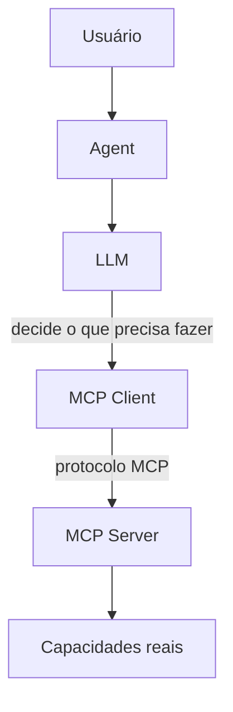
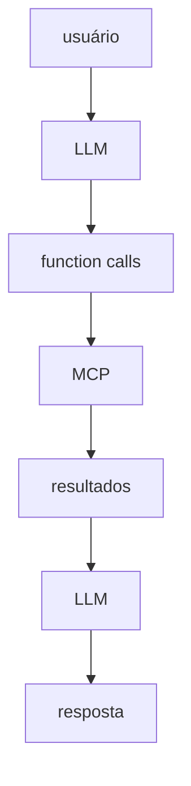
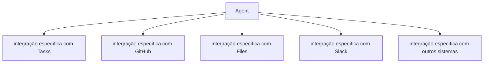
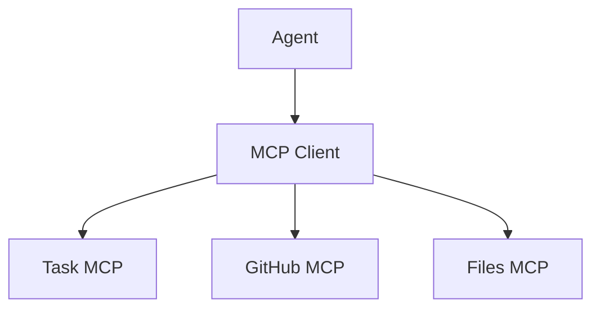

# 1. Conceitos Fundamentais

[← Voltar ao README](../README.md)

## 1.1 Qual é a ideia do projeto?

O projeto começou com uma pergunta simples:

> Como permitir que uma LLM utilize funcionalidades reais de uma aplicação sem acoplar diretamente o modelo ao código?

A resposta estudada foi MCP.

A arquitetura mental principal é:



O ponto mais importante é:

> **MCP não é o agente e MCP não é a inteligência.**

MCP fornece um protocolo padronizado para disponibilizar capacidades e contexto.

A inteligência continua sendo responsabilidade da LLM e da lógica de orquestração do Agent.

---

## 1.2 Separando os conceitos

Durante o estudo, quatro componentes apareceram constantemente:

```text
LLM
Agent
MCP Client
MCP Server
```

Eles não são a mesma coisa.

### LLM

A LLM interpreta linguagem natural e decide o que precisa acontecer.

Exemplo:

```text
Usuário:
"Crie uma tarefa chamada Estudar MCP"
```

A LLM pode concluir:

```text
Preciso utilizar create_task.
```

Ela produz uma chamada estruturada. Conceitualmente:

```json
{
  "name": "create_task",
  "arguments": {
    "title": "Estudar MCP"
  }
}
```

A LLM não executa a função diretamente.

### Agent

O Agent é o orquestrador. Ele coordena:



No projeto, o Agent passou a cuidar de:

- envio da pergunta para a LLM;
- descoberta das capacidades disponíveis;
- execução de Function Calls;
- comunicação com MCP;
- retorno dos resultados à LLM;
- múltiplas iterações;
- contexto multi-turn;
- autorização de ações;
- Human-in-the-loop.

Uma forma simples de pensar:

> **LLM decide. Agent coordena. MCP conecta.**

### MCP Client

O MCP Client conhece o protocolo MCP. Ele consegue realizar operações como:

```text
initialize
tools/list
tools/call
resources/list
resources/read
prompts/list
prompts/get
```

O Agent não precisa conhecer detalhes de JSON-RPC ou transporte. Ele pede ao MCP Client:

```text
Liste as Tools.
```

ou:

```text
Execute create_task.
```

O Client traduz isso para MCP.

### MCP Server

O MCP Server publica capacidades. No laboratório ele disponibiliza:

```text
Tools
Resources
Prompts
```

Ele funciona como uma fronteira entre o mundo MCP e funcionalidades reais.

---

## 1.3 O problema que MCP resolve

Sem um protocolo como MCP, uma integração poderia ficar assim:



Cada integração teria seu próprio formato.

MCP propõe uma interface padronizada:



O Agent pode descobrir capacidades dinamicamente. Esse é um dos principais motivos pelos quais MCP é interessante para aplicações agentic.

---

## 1.4 Os três conceitos principais do MCP

No projeto estudamos:

```text
Tools
Resources
Prompts
```

Uma forma simples de memorizar:

```text
TOOL
"Faça algo"

RESOURCE
"Leia algo"

PROMPT
"Use esta orientação"
```

---

[← Voltar ao README](../README.md) · [Próximo: Tools e Function Calling →](02-tools-e-function-calling.md)
