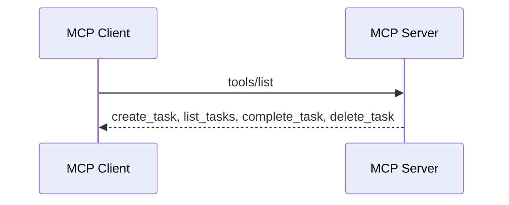
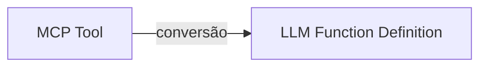
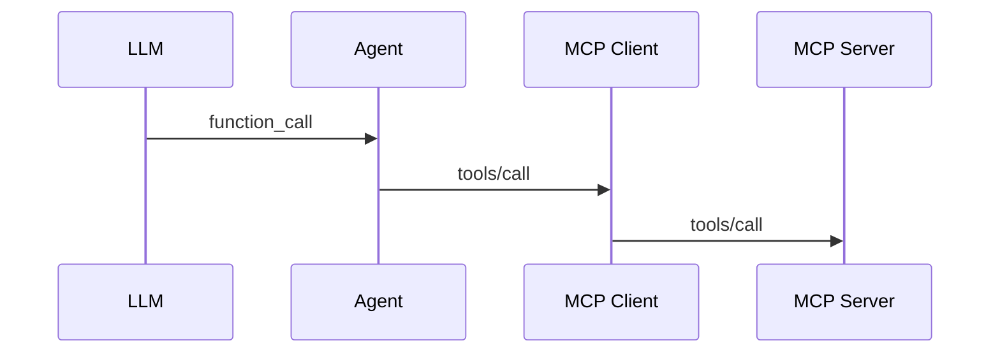
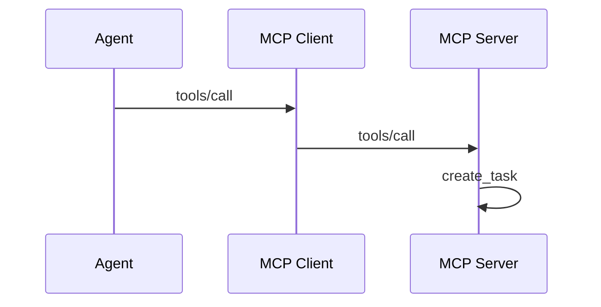
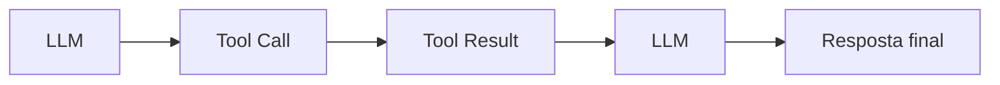

# 2. MCP Tools e Function Calling

[← Voltar ao README](../README.md)

## 2.1 MCP Tools

Tools são capacidades que podem ser executadas.

No laboratório:

```text
greet
calculate
create_task
list_tasks
complete_task
delete_task
```

Uma Tool possui informações como:

```text
name
description
input schema
annotations
```

Exemplo conceitual:

```text
name:
create_task

description:
Cria uma nova tarefa

input:
{
    title: string
}
```

Quando o MCP Client executa `tools/list`, ele descobre essas informações.

---

## 2.2 Tool Discovery

Tool Discovery é um conceito central.

O Agent não deveria precisar ter isto hardcoded:

```go
if userWantsCreateTask {
    callCreateTask()
}
```

Em vez disso:



Essas definições são apresentadas à LLM. A LLM passa a saber:

```text
"Estas são as capacidades que tenho disponíveis."
```

Então ela decide qual usar.

---

## 2.3 Function Calling não é MCP

Essa distinção é muito importante.

A OpenAI possui um mecanismo de **Function Calling**. MCP possui **Tools**. São conceitos relacionados, mas diferentes.

No projeto fazemos uma ponte:



Depois:



Portanto:

> A LLM não está "falando MCP".

O Agent e o MCP Client fazem essa integração.

---

## 2.4 Exemplo completo de uma Tool

Usuário:

```text
Crie uma tarefa chamada Estudar Sampling.
```

Primeiro, a LLM conhece `create_task(title)`. Então decide:

```text
function_call:
create_task

arguments:
{
    "title": "Estudar Sampling"
}
```

O Agent recebe isso. Depois:



O resultado retorna:

```json
{
  "id": 10,
  "title": "Estudar Sampling",
  "completed": false
}
```

O Agent devolve esse resultado à LLM. A LLM finalmente responde:

```text
A tarefa "Estudar Sampling" foi criada.
```

---

## 2.5 Por que devolver o resultado para a LLM?

Não devemos executar a Tool e construir manualmente a resposta final. Queremos:



Isso permite que o modelo interprete o resultado e continue trabalhando.

Exemplo:

```text
Usuário:
"Crie uma tarefa e depois conclua ela."
```

A primeira Tool pode retornar `id = 15`. Agora a LLM sabe que deve utilizar:

```text
complete_task(id=15)
```

Esse comportamento começa a formar um **Agent Loop** — detalhado a seguir.

---

[← Conceitos fundamentais](01-conceitos-fundamentais.md) · [Próximo: Agent Loop →](03-agent-loop.md)
