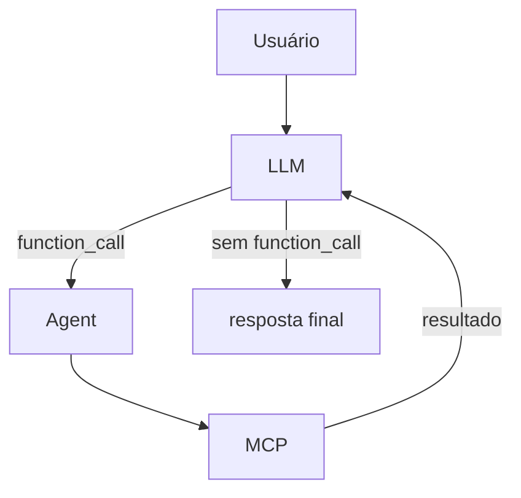
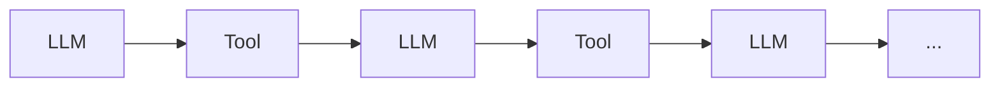
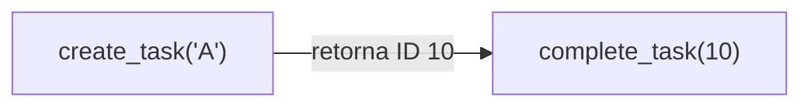

# 3. Agent Loop

[← Voltar ao README](../README.md)

## 3.1 Agent Loop

O Agent Loop é uma das partes mais importantes do laboratório.

Pseudo-fluxo:

```text
enviar input para LLM

enquanto houver function calls:

    executar functions

    enviar resultados para LLM

retornar resposta final
```

Visualmente:



O modelo pode utilizar zero, uma ou várias ferramentas antes de responder.

---

## 3.2 Limite de iterações

Um Agent Loop precisa de proteção.

No laboratório:

```go
const maxIterations = 10
```

Sem isso poderíamos ter um loop indefinido:



O limite protege contra:

- loops acidentais;
- comportamento inesperado;
- excesso de chamadas;
- custos desnecessários.

---

## 3.3 Múltiplas Function Calls

Uma resposta da LLM pode solicitar mais de uma função.

Por isso não devemos pensar em `Response → uma Tool`, mas em `Response → 0..N Function Calls`.

Exemplo:

```text
"Crie uma tarefa A e uma tarefa B."
```

A LLM pode gerar `create_task("A")` e `create_task("B")` na mesma resposta.

O Agent precisa conseguir processar ambas.

---

## 3.4 Chamadas independentes e dependentes

Nem todas as chamadas podem ser feitas juntas.

### Independentes

```text
create_task("A")
create_task("B")
```

Uma não depende da outra.

### Dependentes



A segunda depende do resultado da primeira. Por isso o Agent Loop é importante.

A LLM pode iterar:

```text
Iteração 1 → create_task
Iteração 2 → complete_task
Iteração 3 → resposta
```

---

[← Tools e Function Calling](02-tools-e-function-calling.md) · [Próximo: Resources →](04-resources.md)
