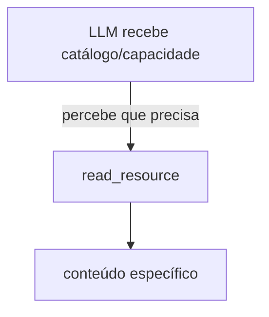
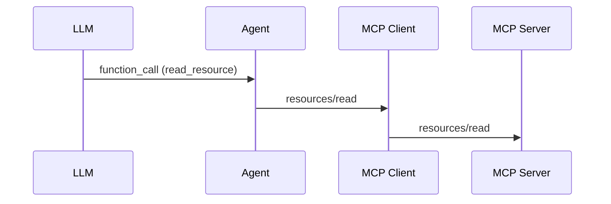

# 4. MCP Resources

[← Voltar ao README](../README.md)

## 4.1 MCP Resources

Resources representam informações que podem ser consultadas.

No laboratório:

```text
tasks://summary
tasks://{id}
```

A ideia é diferente de Tool:

```text
Tool     → executar capacidade
Resource → acessar contexto/informação
```

Exemplo: `tasks://summary` pode retornar:

```json
{
  "total": 3,
  "completed": 1,
  "pending": 2
}
```

---

## 4.2 Resource URI

Resources possuem URIs. Exemplo: `tasks://summary`.

Isso funciona como uma identificação do recurso. Podemos pensar:

```text
scheme:   tasks
resource: summary
```

O Agent não precisa saber como essa informação foi produzida. Ele apenas lê `tasks://summary`.

---

## 4.3 Resource Templates

Também estudamos Resource Templates.

Exemplo: `tasks://{id}` representa uma família de Resources. Pode gerar `tasks://1`, `tasks://2`, `tasks://100`.

Então `tasks://summary` é um Resource concreto, enquanto `tasks://{id}` é um template.

---

## 4.4 Lazy Resource Reading

Uma decisão importante foi:

> Não carregar o conteúdo de todos os Resources para a LLM antecipadamente.

Imagine futuramente 100 arquivos, 500 issues, 200 documentos, 1000 tarefas. Enviar tudo para a LLM seria caro e desnecessário.

Preferimos:



Isso é **lazy loading de contexto**.

---

## 4.5 `read_resource` no Agent

Para permitir que a LLM leia Resources, criamos uma função interna: `read_resource`.

Ela não é uma MCP Tool publicada pelo servidor — é uma capacidade do Agent.

Fluxo:



Isso mostra que:

> Nem toda Function Call exposta à LLM precisa ser uma MCP Tool.

O Agent também pode possuir capacidades internas.

---

[← Agent Loop](03-agent-loop.md) · [Próximo: Prompts →](05-prompts.md)
