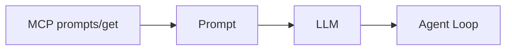

# 5. MCP Prompts

[← Voltar ao README](../README.md)

## 5.1 MCP Prompts

Prompts são templates reutilizáveis fornecidos pelo MCP Server.

No laboratório: `task-review`.

O Prompt pode orientar:

```text
Analise as tarefas atuais.
Consulte os Resources necessários.
Informe concluídas e pendentes.
Não modifique tarefas.
```

Então `/prompt task-review` faz:



---

## 5.2 Tools x Resources x Prompts

Essa tabela mental é uma das mais importantes do estudo:

| Conceito | Pergunta mental |
|---|---|
| **Tool** | O que posso FAZER? |
| **Resource** | O que posso LER? |
| **Prompt** | COMO devo abordar esta atividade? |

Exemplo:

```text
Tool:     delete_task
Resource: tasks://10
Prompt:   task-review
```

---

## 5.3 MCP não é IA

Esse foi um dos conceitos mais importantes do laboratório.

MCP Server não decide "Vou criar uma tarefa." Ele apenas diz "Eu possuo uma capacidade chamada create_task."

Quem interpreta "Crie uma tarefa para amanhã" é a LLM.

Portanto:

```text
MCP ≠ LLM
MCP ≠ Agent
MCP ≠ Raciocínio
```

---

[← Resources](04-resources.md) · [Próximo: CLI, Multi-turn e Estado →](06-cli-multiturn-estado.md)
