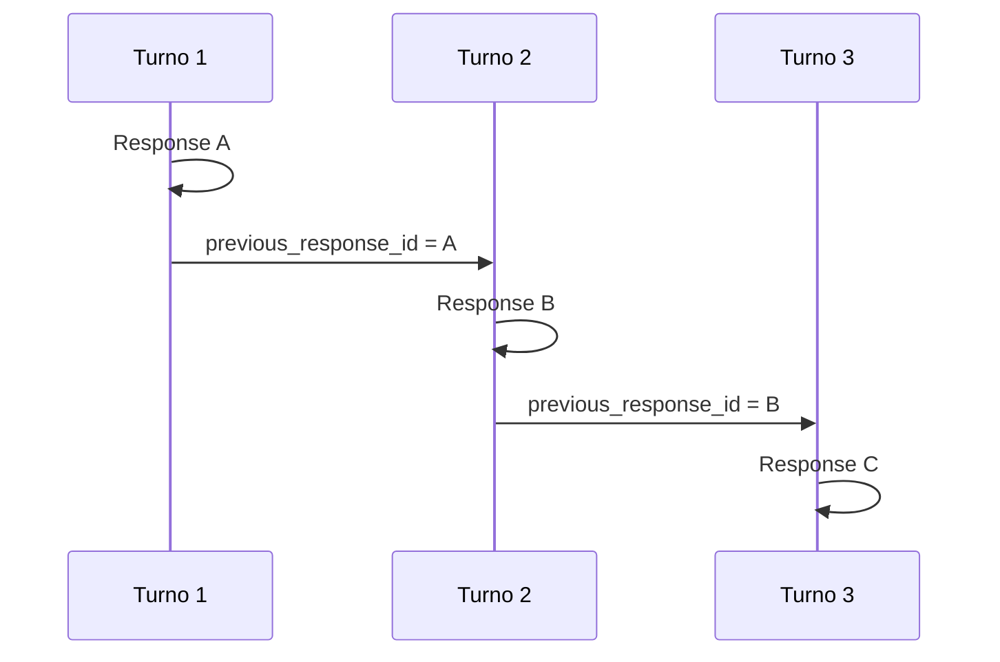

# 6. CLI Interativa, Multi-turn e Estado

[← Voltar ao README](../README.md)

## 6.1 CLI interativa

No começo o cliente executava uma pergunta fixa. Isso dificultava entender o comportamento agentic.

Então criamos uma CLI:

```text
> Liste minhas tarefas

> Crie uma tarefa chamada Estudar MCP

> Agora conclua ela

> Exclua a última

> /tools

> /resources

> /prompts
```

Isso permitiu observar o Agent tomando decisões em tempo real.

---

## 6.2 Multi-turn

Depois adicionamos contexto conversacional.

Exemplo:

```text
> Crie uma tarefa chamada Estudar Sampling.

Tarefa criada.

> Agora conclua ela.
```

A palavra "ela" não possui ID, mas o contexto anterior permite à LLM entender a referência.

---

## 6.3 `previous_response_id`

A Responses API permite encadear respostas.



O Agent mantém esse identificador dentro da Session.

---

## 6.4 Conversation State não é estado da aplicação

Uma distinção importante: **Conversation State** é diferente de **Application State**.

Exemplo: `/reset` remove o contexto conversacional, mas não significa "apagar tarefas".

```text
/reset
   → Session.Reset()

NÃO:
   → delete all tasks
```

---

## 6.5 Três tipos de estado

Durante o estudo apareceram três conceitos:

1. Conversation State
2. Application State
3. Long-term Agent Memory

No laboratório:

```text
Conversation State      → implementado através da Session
Application State       → existe na aplicação
Long-term Agent Memory  → ainda não implementado
```

É importante não misturar esses conceitos.

---

[← Prompts](05-prompts.md) · [Próximo: Human-in-the-loop e Permissões →](07-human-in-the-loop-e-permissoes.md)
