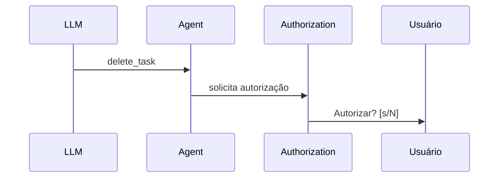
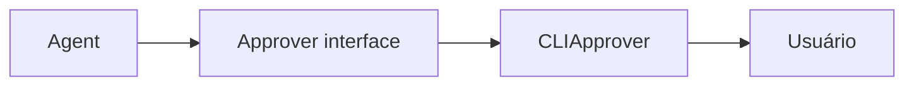
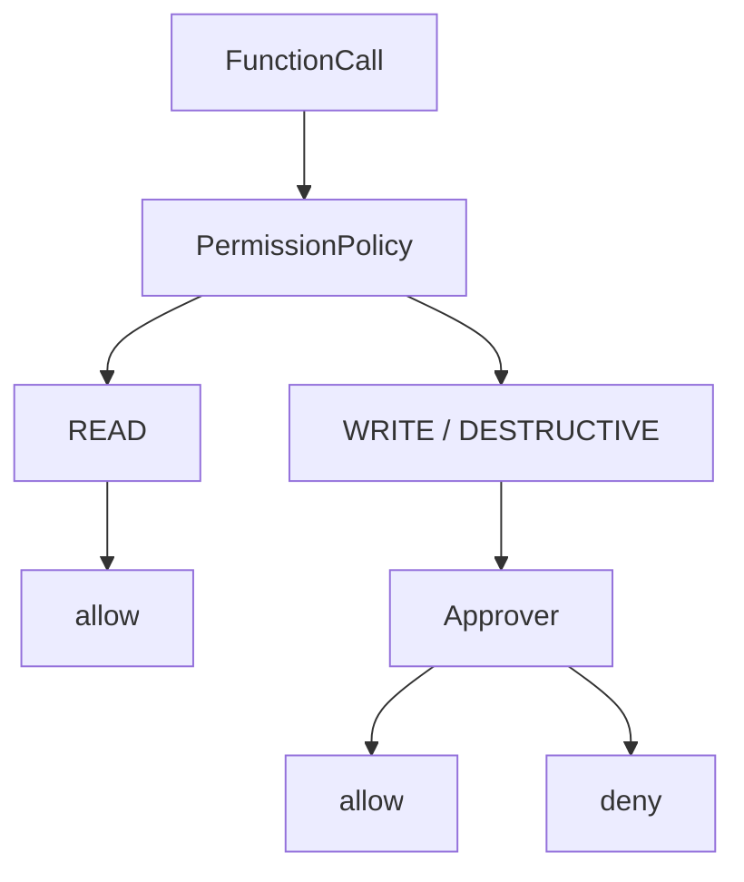
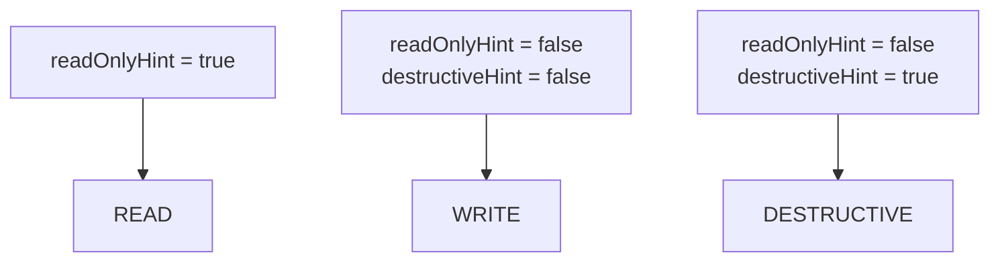
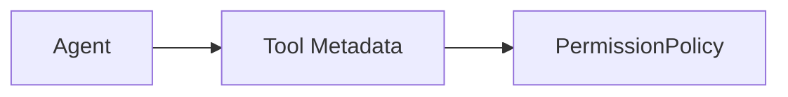
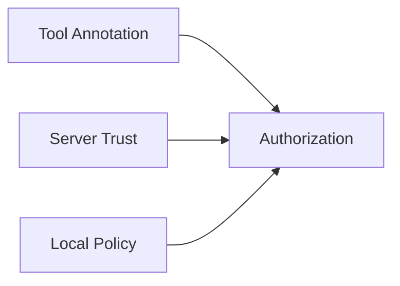

# 7. Human-in-the-Loop e Permissões

[← Voltar ao README](../README.md)

## 7.1 Human-in-the-loop

Devemos deixar a LLM executar qualquer Tool automaticamente? Para consultas simples como `list_tasks`, isso pode ser aceitável. Mas `delete_task` é diferente.

Então introduzimos **Human-in-the-loop (HITL)**.



---

## 7.2 Contexto não significa autorização

Imagine: `> Crie uma tarefa chamada Teste.` — usuário autoriza. Depois: `> Agora exclua ela.` — a LLM sabe qual tarefa é, mas isso não significa que a exclusão está automaticamente autorizada.

```text
Context != Authorization
```

A nova operação precisa passar novamente pela policy.

---

## 7.3 Approver

O Agent não deve ler diretamente `stdin`. Criamos uma abstração: `Approver`.

Hoje: `CLIApprover`. No futuro poderia existir `WebApprover`, `MobileApprover`, `SlackApprover`, `HTTPApprover`.



Assim o Agent não depende do terminal.

---

## 7.4 Rejeição não é erro

Se o usuário responder `n`, isso não significa erro do sistema — é uma decisão válida.

O Agent devolve para a LLM algo semelhante a:

```json
{
  "success": false,
  "rejected": true
}
```

A LLM pode responder "A ação não foi realizada porque você não a autorizou." O Agent Loop continua funcionando.

---

## 7.5 Permission Levels

Criamos uma classificação conceitual: `READ`, `WRITE`, `DESTRUCTIVE`.

| Nível | Descrição | Exemplos |
|---|---|---|
| **READ** | Não modifica estado | `list_tasks`, `calculate`, `greet`, `read_resource` |
| **WRITE** | Modifica estado | `create_task`, `complete_task` |
| **DESTRUCTIVE** | Pode remover ou destruir estado | `delete_task` |

---

## 7.6 Authorization Flow



---

## 7.7 Deny by default

> Se não sabemos o nível de risco de uma capacidade, não devemos executá-la automaticamente.

```text
UNKNOWN → DENY
```

Esse princípio evita: Tool nova → esquecemos de classificar → Agent executa automaticamente.

---

## 7.8 MCP Tool Annotations

A evolução mais recente foi perceber que não queremos algo como:

```go
"delete_task": PermissionDestructive
```

hardcoded no Agent.

O MCP possui **Tool Annotations**, que podem informar características como:

```text
readOnlyHint
destructiveHint
idempotentHint
openWorldHint
```

Assim a própria Tool fornece sinais sobre seu comportamento.

---

## 7.9 Derivando permissões das annotations



O Agent deixa de conhecer nomes específicos.

---

## 7.10 Por que isso melhora a arquitetura?

Antes:

```text
Agent
├── create_task = WRITE
├── complete_task = WRITE
└── delete_task = DESTRUCTIVE
```

Isso cria acoplamento. Depois:



Agora o Agent entende **características**, não nomes de domínio. Isso será importante ao adicionar novos MCP Servers.

---

## 7.11 Tool Annotations são hints

Annotations não devem ser entendidas como verdade absoluta de segurança.



Isso é especialmente importante quando o Agent começar a consumir MCP Servers que não controlamos.

---

## 7.12 Idempotência

Uma annotation estudada foi `idempotentHint`.

Uma operação idempotente pode ser repetida sem mudar novamente o estado final.

Exemplo: `complete_task(10)` executado duas vezes → estado final `task 10 = completed`.

Já `create_task("A")` executado duas vezes pode criar duas entidades. Então `create_task` normalmente não é idempotente.

---

## 7.13 Open World

Outra annotation: `openWorldHint`. Ela ajuda a indicar se a Tool interage com entidades externas.

Exemplos futuros: `send_email`, `create_github_issue`, `post_message`, `call_external_api` — podem possuir características diferentes de uma Tool totalmente local.

Isso pode ser usado futuramente na Permission Policy.

---

[← CLI, Multi-turn e Estado](06-cli-multiturn-estado.md) · [Próximo: Arquitetura e Execução →](08-arquitetura-e-execucao.md)
