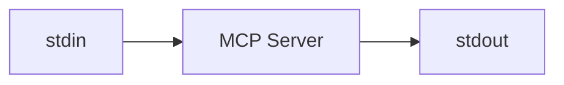
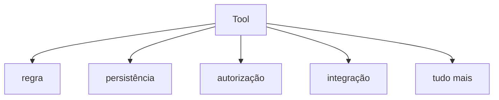
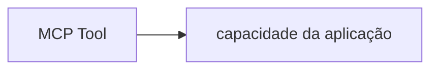

# 9. Boas Práticas

[← Voltar ao README](../README.md)

## 9.1 O que observar enquanto roda

Não olhe apenas para a resposta final. Observe o processo:

```text
Qual Tool a LLM escolheu?

Quais argumentos ela produziu?

Foi necessário mais de um Function Call?

A chamada era READ, WRITE ou DESTRUCTIVE?

O Agent pediu autorização?

O resultado da Tool voltou para a LLM?

A LLM fez outra chamada?

Quando o Agent Loop terminou?
```

O objetivo do laboratório é entender esse fluxo.

---

## 9.2 Erro clássico de STDIO

MCP via STDIO usa stdout como canal do protocolo.

Portanto, no MCP Server, evite:

```go
fmt.Println("debug")
```

Isso pode misturar texto com mensagens do protocolo.

Modelo mental:



`stdout` deve permanecer reservado ao transporte MCP. Para logs, use `stderr`.

---

## 9.3 O que NÃO colocar dentro de uma MCP Tool

Evite transformar a Tool em toda a aplicação:



Prefira:



MCP deve funcionar como **adapter**. Isso facilita utilizar a mesma aplicação através de MCP, REST, CLI ou eventos, sem duplicar lógica.

---

[← Arquitetura e Execução](08-arquitetura-e-execucao.md) · [Próximo: Roadmap e Próximos Passos →](10-roadmap-e-proximos-passos.md)
