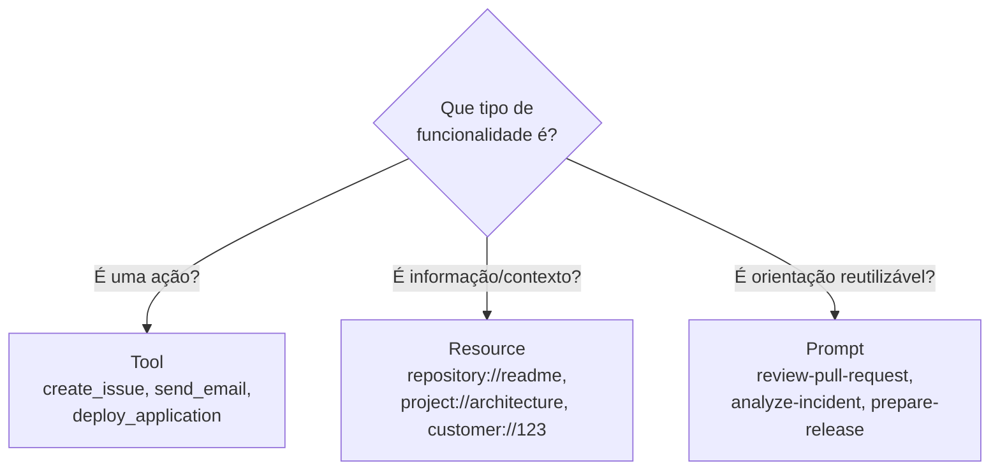
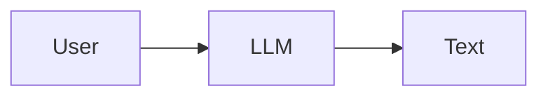
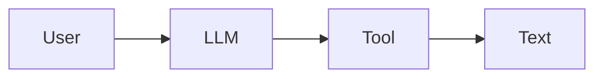
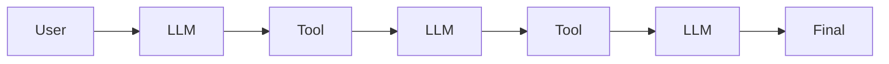
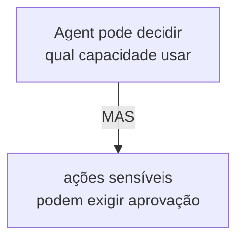
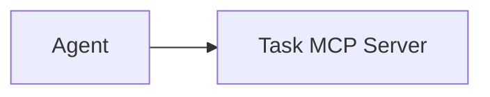
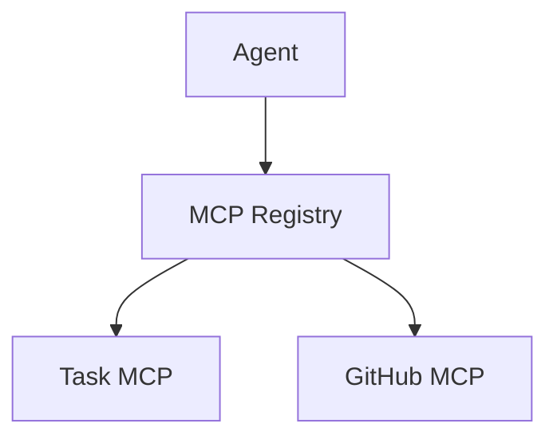
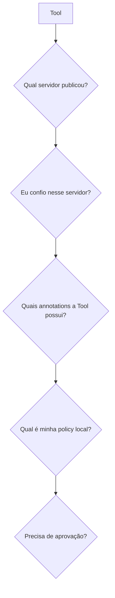
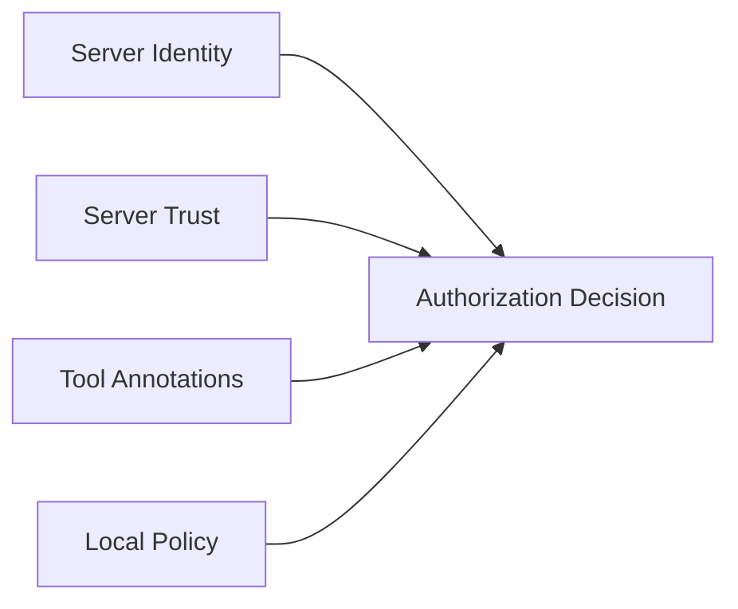
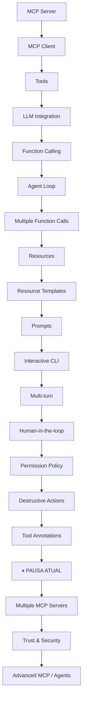

# 10. Roadmap e Próximos Passos

[← Voltar ao README](../README.md)

## 10.1 Como pensar em MCP durante novos projetos

Ao encontrar uma funcionalidade, pergunte:

---

## 10.2 Quando uma aplicação começa a parecer um Agent?

Somente utilizar uma LLM não significa necessariamente ter um Agent.

Exemplo simples:

Com ferramentas:

Com Agent Loop:

Agora existe um processo iterativo de decisão e execução. Adicionando `state`, `permissions`, `human approval` e `external capabilities`, temos uma arquitetura agentic cada vez mais completa.

---

## 10.3 Autonomia controlada

Um Agent útil não precisa ter autonomia irrestrita. Nosso modelo é:

Isso cria **Autonomia + Controle**.

Human-in-the-loop não reduz o conceito de Agent — ele define limites para a autonomia.

---

## 10.4 Próximo grande passo

O projeto foi pausado neste ponto. A próxima evolução recomendada é: **múltiplos MCP Servers.**

Hoje:

Depois:

Isso permitirá estudar:

- múltiplas sessões MCP;
- discovery agregado;
- roteamento de Tools;
- origem de cada Tool;
- colisão de nomes;
- trust por servidor;
- autorização baseada em origem;
- Tool Annotations de servidores diferentes.

---

## 10.5 Evolução futura de segurança

Com vários servidores:

Arquitetura:

Esse será um passo importante para sair de um laboratório simples para um Agent mais próximo de aplicações reais.

---

## 10.6 Outros assuntos para estudar depois

Após múltiplos MCP Servers:

1. Server Registry
2. Server Trust
3. Streaming
4. Elicitation
5. Sampling
6. Observability
7. Agent testing
8. Web UI
9. Agent memory
10. MCP remoto

Cada tema deve ser introduzido isoladamente para entender claramente sua responsabilidade.

---

## 10.7 Mapa do aprendizado

---

[← Boas Práticas](09-boas-praticas.md) · [Próximo: Resumo e Checklist →](11-resumo-e-checklist.md)
